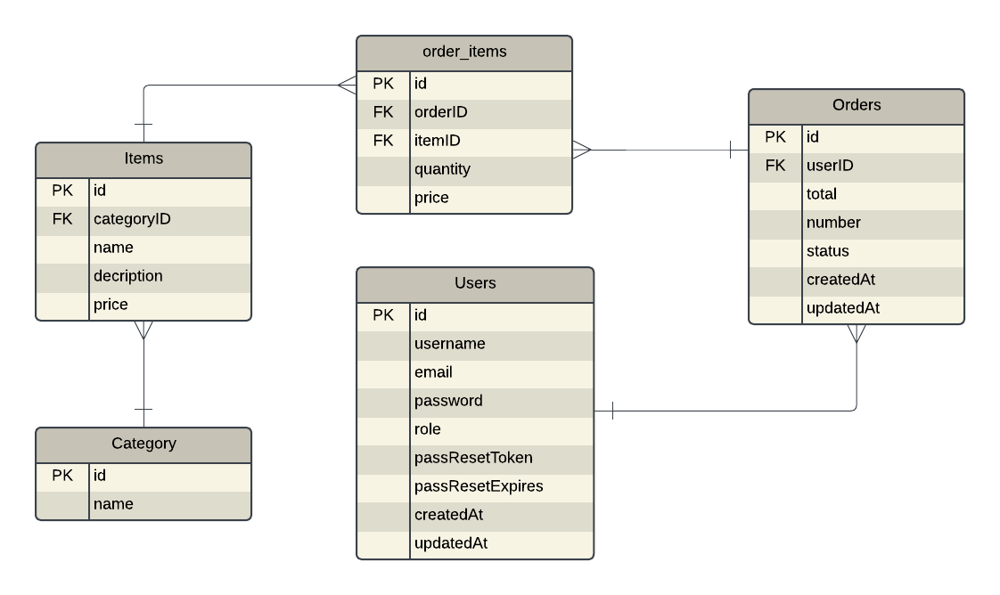

# Simplified Restaurant Management System

## Overview

This is a **Simplified Restaurant Management System API** that supports **menu management, order management, and user authentication**. The system is built using **Node.js** with the **Express.js** framework and uses **Sequelize** to interact with a relational database.

---

## Features

### 1. Menu Management

- Admins can:
  - Perform CRUD operations on menu items (name, description, price, category).

### 2. Order Management

- **Restaurant staff** can:
  - Take orders.
  - Add/remove items from a pending order.
  - Mark orders as complete.

- **Admins** can:
  - View and manage all orders.
  - Check order details and statuses.
  - update order status.
  - View orders report and export as csv file.

### 3. User Authentication

- Role-based access control for:
  - **Admins**.
  - **Restaurant staff**.
- Only authenticated users can access order functionalities.

- **Auth Functionalities**
  - Register
  - Login
  - Forgot Password which send verification code to user via gmail.
  - Verify the verification code that sent to user's email then reset password.

### 4. Items
  - Filter menu items by category.
  - Sort menu items by price (ascending/descending).
  - Get item details.
  - Top 10 selling items last 30 days.

### 5. System
  - Automatically mark orders as "expired" if they are still pending 4 hours after creation.

---

## Technical Stack

- **Backend**: Node.js with Express.js framework.
- **Database**: MySQL with Sequelize ORM.
- **Testing**: Focused automated tests for critical endpoints.
- **API Documentation**: Interactive documentation using Postman.

---
### Database Schema


## Setup and Installation

### Prerequisites

1. Node.js (>= 14.x)
2. NPM 
3. MySQL database
4. Postman 

### Installation Steps

1. Clone the Repository:

   ```bash
   git clone https://github.com/Rewan-Adel/Restaurant-Management-System.git
   cd Restaurant-Management-System
   ```

2. Install Dependencies:

   ```bash
   npm install
   ```

3. Configure Environment Variables:

   - Create a `.env` file in the root directory.
   - Add the following variables:
     ```env
     NODE_ENV       = development
     PORT           = 3000
     DB_HOST        = localhost
     DB_USER        = your_db_user
     DB_PASS        = your_db_password
     DB_NAME        = restaurant_db
     EMAIL_SENDER   = your_gmail_acc 
     EMAIL_PASSWORD = gmail_app_password
     TOKEN_SECRET   = your_secret_key
     JWT_EXPIRATION = 7d
     ```

4. Start the Server:

   ```bash
   npm start
   ```

   The server will run on `http://localhost:3000` by default.

---

## API Documentation

The API is documented using **Postman**. You can view the documentation interactively:

- **Postman**: Import the provided Postman collection from the repository. or visit `https://www.postman.com/notnull-7187/workspace/restaurant-documentation/collection/25350743-10a07f45-b8c2-4747-a730-e2ab2106bab1?action=share&creator=25350743`

### Sample Endpoints

#### Menu Management
1. **Get Top 10 selling items last 30 days**:
    it 
   ```http
   GET /api/v1/menu/top-selling
   ```
    - Response:
     ```json
      {
        "success": true,
        "message": "Top selling items retrieved successfully",
        "data": {
          "topItems": [
            {
              "itemID": 1,
              "name": "Classic Burger",
              "price": 12.99,
              "totalSold": 150
            },
            {
              "itemID": 2,
              "name": "Veggie Delight",
              "price": 9.99,
              "totalSold": 120
            }
          ]
        }

     }
     ```

2. **Create Menu Item** (Admins only):
    it 
   ```http
   POST /api/v1/menu/admin/add
   ```
    - Response:
     ```json
     {
        "success": true,
        "message": "Top selling items retrieved successfully",
        "data": {
          "topItems": [
            {
              "itemID": 1,
              "totalSold": 150,
              "name": "Classic Burger",
              "price": 12.99
            },
            {
              "itemID": 2,
              "totalSold": 120,
              "name": "Veggie Delight",
              "price": 9.99
            }
          ]
        }
     }
     ```

2. **Get Menu Items**:

   ```http
   GET /api/v1/menu?category=Burg&sort=asc
   ```

   - Response:
     ```json
     [
       {
       "name": "Classic Burger",
       "description": "Delicious beef burger with cheese",
       "price": 12.99,
       "category": "Burgers"
     },{}, {}, ...
     ]
     ```

#### Order Management

1. **Create Order**:

   ```http
   POST /api/v1/order/new
   ```

   - Request Body:
     ```json
     {
       "items": [
         { "itemID": 1, "quantity": 2 },
         { "itemID": 2, "quantity": 1 }
       ]
     }
     ```
   - Response:
     ```json
     {
       "success": true,
       "message": "Order created successfully",
       "data": { ... }
     }
     ```

2. **Mark Order as Complete**:

   ```http
   PUT /api/v1/order/complete/:orderID
   ```
  - Response:
     ```json
     {
        "status": true,
    "message": "Order marked as completed successfully",
    "data": {
        "order": {
            "id": 2,
            "userID": 2,
            "total": "22.47",
            "status": "completed",
            "number": 1002,
            "createdAt": "2024-12-05T11:00:00.000Z",
            "updatedAt": "2024-12-15T22:14:01.265Z",
            "orderedBy": {
                "id": 2,
                "username": "staff 1"
            },
            "items": [
                {
                    "id": 1,
                    "name": "Classic Burger",
                    "price": "8.99",
                    "order_items": {
                        "price": "4.99",
                        "quantity": 2
                    }
                },
                {...},{...},...
            ]
        }
    }
     }
     ```

3. **Get All Orders for staff member**:
    - this endpoint get all orders that ordered by authenticated staff member 
   ```http
   PUT /api/v1/order/all
   ```
  - Response:
     ```json
     {
        "status": true,
    "message": "Orders retrieved successfully",
    "data": {
        "order": {
            "id": 2,
            "userID": 2,
            "total": "22.47",
            "status": "completed",
            "number": 1002,
            "createdAt": "2024-12-05T11:00:00.000Z",
            "updatedAt": "2024-12-15T22:14:01.265Z",
            "orderedBy": {
                "id": 2,
                "username": "staff 1"
            },
            "items": [
                {
                    "id": 1,
                    "name": "Classic Burger",
                    "price": "8.99",
                    "order_items": {
                        "price": "4.99",
                        "quantity": 2
                    }
                },
                {...},{...},...
            ]
        },
        {...},
        {...}, ...
    }
     }
     ```

4. **Get All Orders for admins**:
    - this endpoint get all orders in database by authenticated admin. with filtering by status `optional` 
   ```http
   PUT /api/v1/order/admin/all?status=
   ```
  - Response:
     ```json
     {
        "status": true,
    "message": "Orders retrieved successfully",
    "data": {
        "order": {
            "id": 2,
            "userID": 2,
            "total": "22.47",
            "status": "completed",
            "number": 1002,
            "createdAt": "2024-12-05T11:00:00.000Z",
            "updatedAt": "2024-12-15T22:14:01.265Z",
            "orderedBy": {
                "id": 2,
                "username": "staff 1"
            },
            "items": [
                {
                    "id": 1,
                    "name": "Classic Burger",
                    "price": "8.99",
                    "order_items": {
                        "price": "4.99",
                        "quantity": 2
                    }
                },
                {...},{...},...
            ]
        },
        {...},
        {...}, ...
      }
     }
     ```

## Forgot Password Api
- When a user forgets their password, an email is sent:
[!forgotPass](./images//Screenshot%202023-11-11%20202343.png)


## Testing

Run automated tests:

```bash
npm test
```

### Critical API Endpoints Tested:

1. Auth register and login.
2. Menu get all menu items and get one item.

---
